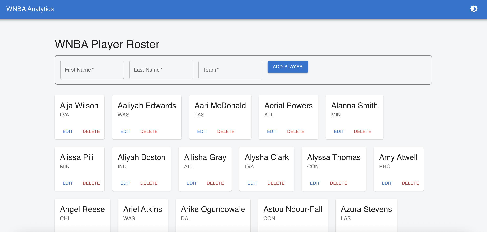

# WNBA Player Analytics & Comparison Engine

A full-stack web application designed to provide advanced statistics and data-driven insights for the WNBA. This project showcases a complete development lifecycle, including a Python/FastAPI backend, a React frontend, a PostgreSQL database, a machine learning model for player similarity, and a professional development workflow using Docker, CI/CD, and automated testing.

 
*Note: Add a screenshot of your application to the `assets` folder to have it display here.*

## ✨ Key Features

* **Full CRUD API:** A robust RESTful API to Create, Read, Update, and Delete players and their seasonal stats.
* **Modern Frontend:** A responsive user interface built with React and Material-UI (MUI), featuring client-side routing, a polished design, and a light/dark mode theme.
* **Player Similarity Engine:** A machine learning model that finds the most statistically similar players for any given player-season, providing unique analytical insights that go beyond standard box scores.
* **Automated Data Seeding:** The application uses clean JSON files, generated by a separate data pipeline, to reliably seed the database with real-world player data.
* **Professional DevOps Workflow:**
    * Containerized with **Docker** for consistent development and deployment environments.
    * Full-stack **CI/CD pipeline** with GitHub Actions to lint and run backend & frontend tests on every push.
    * Comprehensive test suite using **Pytest** and **React Testing Library**, including advanced techniques like mocking.
    * Streamlined development workflow with an automated **Makefile**.

## 🛠️ Tech Stack

| Category      | Technology                                    |
|---------------|-----------------------------------------------|
| **Backend** | Python, FastAPI, SQLAlchemy, PostgreSQL       |
| **Frontend** | JavaScript, React, React Router, Material-UI  |
| **ML** | Pandas, Scikit-learn                          |
| **DevOps** | Docker, Docker Compose, GitHub Actions, Pytest, Makefile |


## 🚀 Getting Started (Local Development)

### Prerequisites

* [Docker Desktop](https://www.docker.com/products/docker-desktop/) installed and running.
* A `git` client.
* The `make` command-line tool (pre-installed on macOS/Linux).

### Installation & Setup

1.  **Clone the repository:**
    ```bash
    git clone <your-repo-url>
    cd wnba-analytics
    ```

2.  **Build and start all services:**
    This command will build the Docker images and start the backend, frontend, and database containers in the background.
    ```bash
    make build
    ```

3.  **Populate the database and create the ML model:**
    This command runs the necessary scripts inside the backend container to seed your database with real stats and generate the similarity model files.
    ```bash
    make setup
    ```

    Your application is now running!
    * **Frontend (React App):** [http://localhost:3000](http://localhost:3000)
    * **Backend (API Docs):** [http://localhost:8000/docs](http://localhost:8000/docs)

### Running Tests

To run the entire suite of backend and frontend tests and then clean up the containers, use the following command:

```bash
make test
```

### Data Source

The data for this project is collected and cleaned using a custom Python pipeline that scrapes publicly available statistics from basketball-reference.com. The code for this data pipeline is maintained in a separate, private repository to decouple data acquisition from the application logic. The cleaned data is stored as JSON files which are then used to seed the application's database.